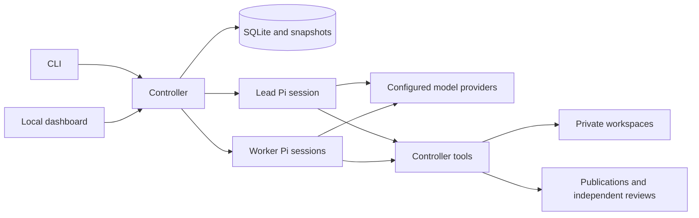

# Architecture

`team.py` configures and controls the service. `configuration.py` validates the roster and provider settings, and pins them to the selected state directory.

`server.py` runs one actor loop per agent, with a semaphore for each provider's concurrency limit. `runtime.py` launches an independent Pi RPC process and persistent session per actor. `extension.ts` exposes the controller's tools to Pi, delivers peer messages between turns, enforces yielding after the current tool batch, and supplies a bounded durable checkpoint for compaction.

Task state normally moves from queued to assigned, review and done. A rejected review returns work to its owner. Paused, blocked and cancelled tasks remain explicit. Cancellation retains a disposition obligation; it does not imply acceptance of unfinished scope.

`store.py` records assignments, delivery positions, events and idempotent tool calls. `publication.py` validates complete publication transactions, seals source snapshots and recovers interrupted publications. `handoffs.py` binds a formal review to exact files, version and publication identity. `acceptance.py` checks criteria and evidence provenance. `snapshot_evidence.py` executes a private copy of a publication and retains source, environment and result bindings.

`workflow.py`, `progress.py`, `completion_health.py` and `resilience.py` detect unreachable dependencies, outstanding decisions, stalled reviews and repeated unproductive calls. They can remind participants, preserve recovery checkpoints and transfer eligible work. They do not automatically approve artifacts. Participant failures are tracked separately so one failed actor does not terminate its peers.

`project_files.py` selects source using Git ignore rules and avoids copying environments, selected secret-file names or symlinks. `host_executor.py` manages native subprocess groups so interruption targets the commands it started. Source selection is not a general secret scanner. Agents with native host tools can access other files available to the controller account.

## Provider settings

The provider section uses Pi's custom-provider model metadata. `api_key_env` becomes a credential environment-variable reference in the generated private Pi configuration. `request_overrides` optionally adds explicit generation settings such as `chat_template_kwargs` or `reasoning_effort`; it should match the backend's actual API. The harness does not infer backend-specific thinking switches from model names.

Compaction reserves must fit the smallest configured model context. The checkpoint keeps task state and retrieval pointers, while full messages and tool receipts stay on disk. The checkpoint uses bounded text rather than a separate model summary request. Provider-specific tokenization and context handling still require validation against the chosen backend.

## Limits

This is a local trusted-user harness, not a hostile multi-tenant system. Native execution can read undeclared external data; a source hash does not prove that a command used only that source. Dashboard read access is local and unauthenticated. Configuration pinning protects accidental mismatched resumes, not malicious filesystem edits. Back up the complete state directory before manual repair.
